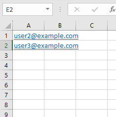
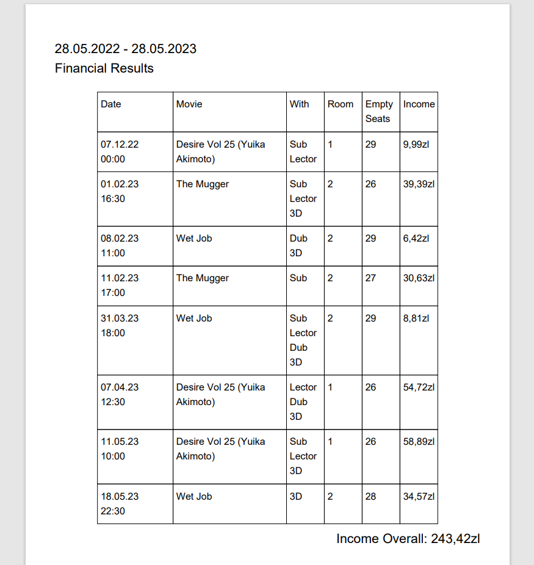

# Cinemanic
ASP .NET Core MVC app for an independent cinema.
The in-depth documentation created with the help of DocFX can be found here: https://melokawka.github.io/Cinemanic/

 

The application focuses on the backend side. Its purpose is for me to learn ASP .NET MVC Framework and test: 
* Wordpress API (managing and creating newses about the cinema), 
* Stripe API (payment system),
* The Movie Database API (randomly retrieving movie information),
* Docker (simplifying app deployment)

 

  
Used technologies
 

  * ASP .NET 6.0 MVC Framework
  * MSSQL
  * Docker 
  * Stripe payment system API
  * Wordpress server
  * The Movie Database (TMDB) API
  * DocFX documentation generator
   

  
Functionalities

   
  
  * The app homepage retrieves (on the client side) and displays posts from the Wordpress server. The Wordpress server is used as a Content Management System for a more convenient way to manage news about the cinema.
  
  * The movies displayed on the homepage are randomly retrieved from the TMDB API (the amount of retrieved movies can be modified at the top of the `./Data/MovieService GetMovies()` method).
  
  * The user can submit an order for multiple tickets in one order. The selected tickets can be checked in the shopping cart page.
  
  * The shopping cart is connected to Stripe API (test mode) and allows for testing payments by credit card.
  
  * The number of tickets in the shopping cart can be checked on the navbar (it's retrieved on the client side from `/koszyk/liczba-produktow` endpoint).
  
  * The user can sign up for the newsletter.
  
  * The admin can generate and download a CSV of newsletter clients' emails.
  
    

      
The CSV looks like this:

      
    

  
  * The admin can generate and download a PDF with a report on the past year's financial results.
  
    

      
The PDF looks like this:

      
    

  

  
App structure on diagrams

  Dropdown menu content goes here.

  
Installation

  Dropdown menu content goes here.

