# Cinemanic
ASP .NET Core MVC app for an independent cinema.

This application serves more as a tech-demo rather than a full-fledged cinema management system.

Business logic documentation and API documentation created with the help of DocFX can be found here: https://melokawka.github.io/Cinemanic/

 

This application focuses on backend. Its purpose is for me to learn ASP .NET MVC Framework and test: 
* Wordpress API (managing and creating news about the cinema), 
* Stripe API (payment system),
* The Movie Database API (randomly retrieving movie information),
* Docker (simplifying app deployment)

 

  
Used technologies
 

  * ASP .NET 6.0 MVC Framework
  * MSSQL
  * Docker 
  * Stripe payment system API
  * Wordpress server
  * The Movie Database (TMDb) API
  * DocFX documentation generator
   

    
Use-case UML diagram

    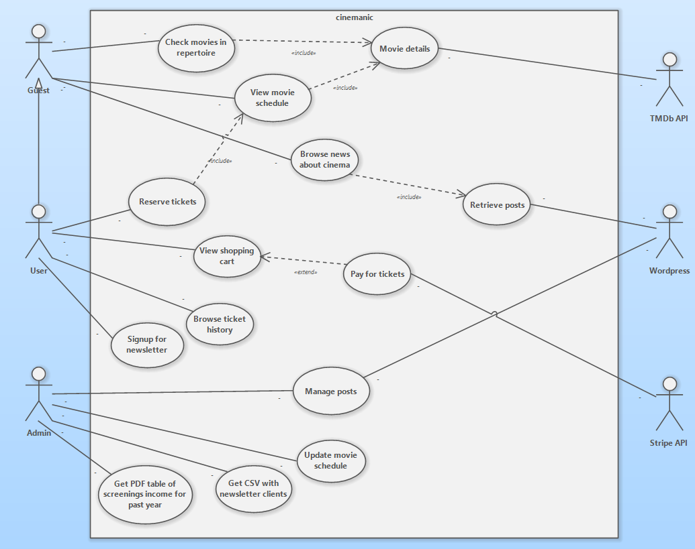

    
ERD diagram

    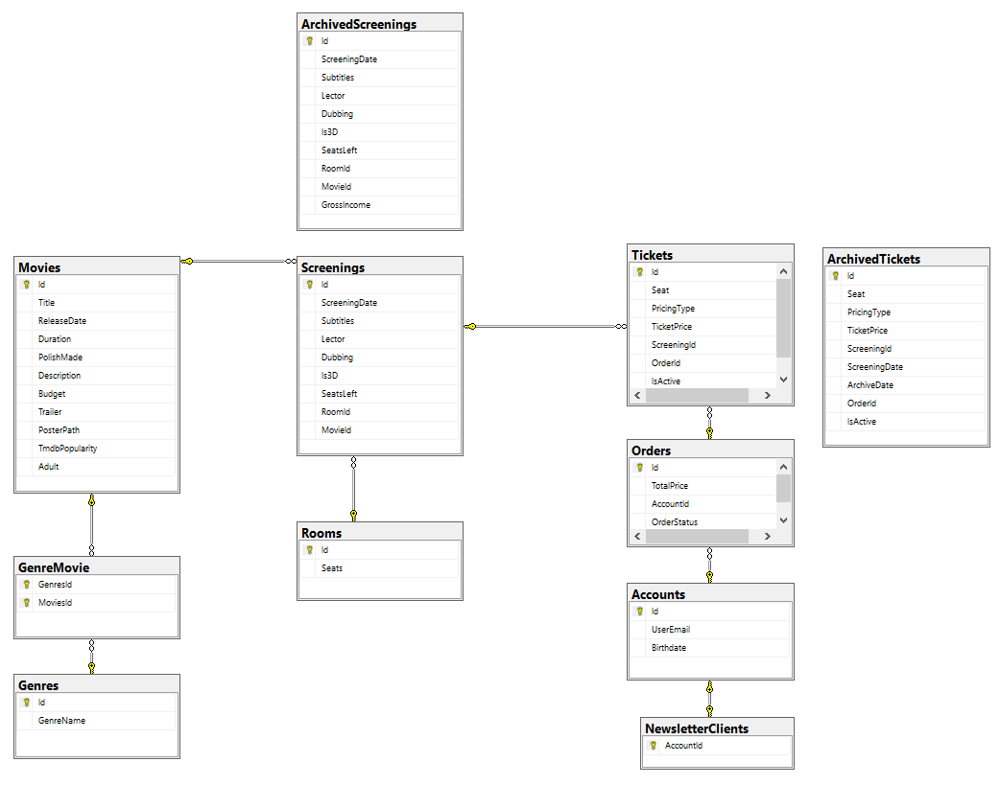

  
Functionalities

   
  
  * The app homepage retrieves (on the client side) and displays posts from the Wordpress server. The Wordpress server is used as a Content Management System for a more convenient way to manage news about the cinema.
  
  * The movies displayed on the homepage are randomly retrieved from the TMDB API (the amount of retrieved movies can be modified at the top of the `./Data/MovieService GetMovies()` method).
  
  * The user can submit an order for multiple tickets in one order. The selected tickets can be checked in the shopping cart page.
  
  * The shopping cart is connected to Stripe API (test mode) and allows for testing payments by credit card.
  
  * The number of tickets in the shopping cart can be checked on the navbar (it's retrieved on the client side from `/koszyk/liczba-produktow` endpoint).
  
  * The user can sign up for the newsletter by clicking Newsletter tab on the navbar after logging in.
  
  * The admin can generate and download a CSV of newsletter clients' emails.
  
    

      
The CSV looks like this:

      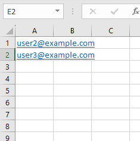
    

  
  * The admin can generate and download a PDF with a report on the past year's financial results.
  
    

        
The PDF looks like this:

        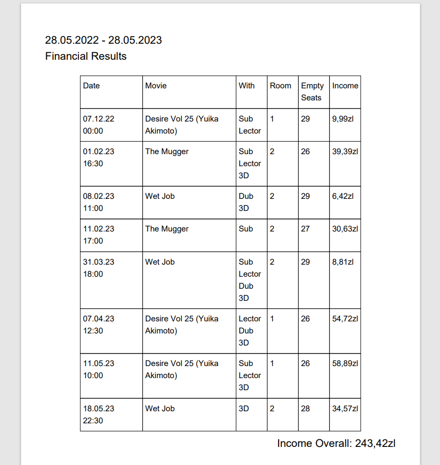
    

  
 

  
Views

   
  
  * Posts at the bottom of the homepage:
  
  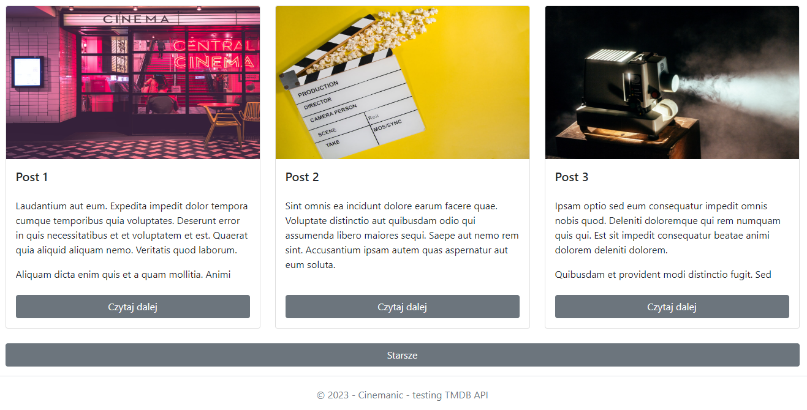
  
  * Posts on the Wordpress page:
  
  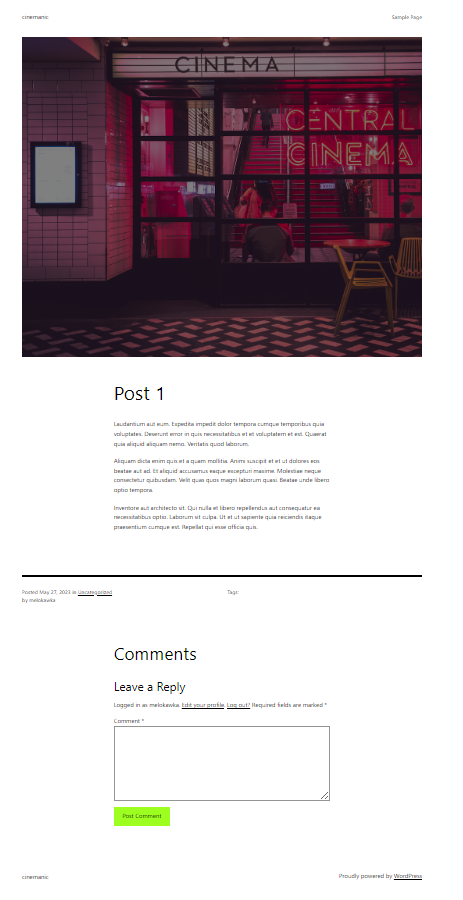
  
  * Creating posts on the Wordpress server:
  
  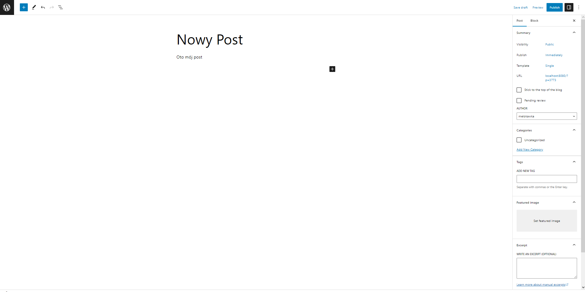
  
  * Movie information displayed on the homepage:
  
  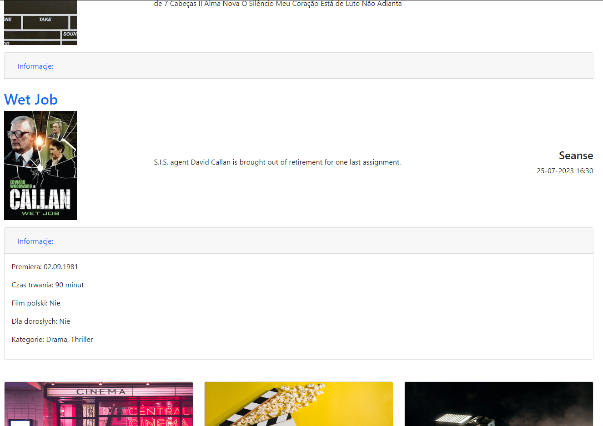
  
  * Shopping cart view:
  
  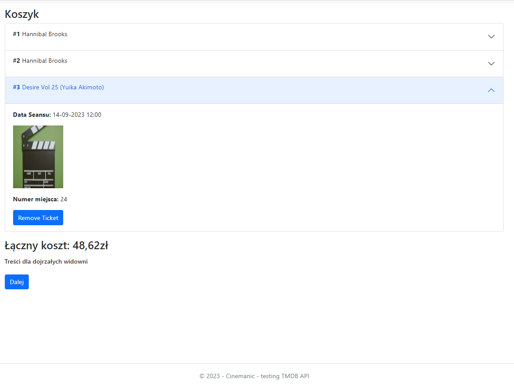
  
  * Stripe payment by card:
  
  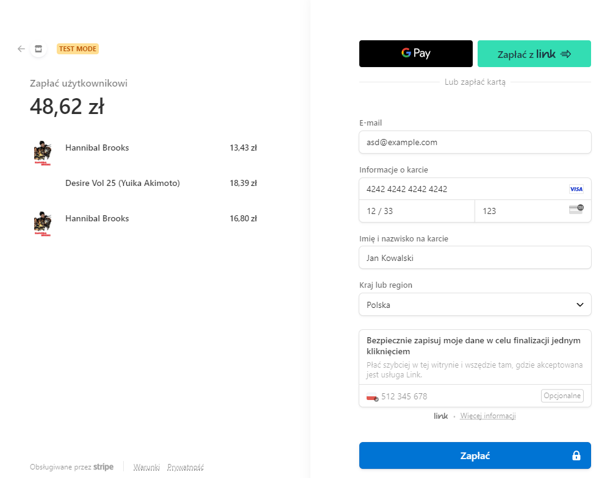
  
  * Payment confirmation view:
  
  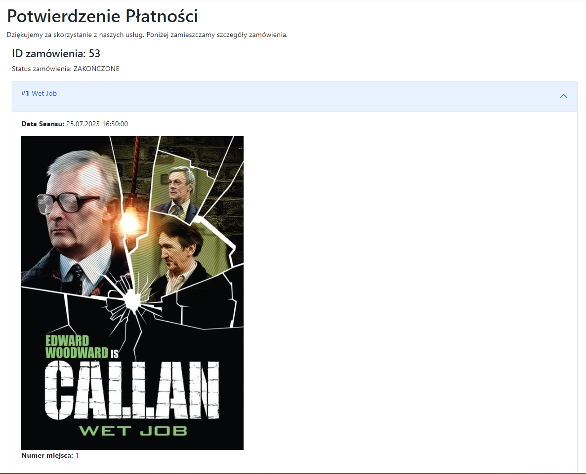
  
  * Stripe dashboard:
  
  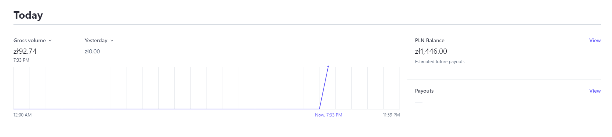
  
  * Shopping cart icon:
  
  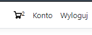
  

  
Installation

   
  
  You require Docker Desktop app in Linux Containers mode.
  
  Make sure your client has free 1433 (database) and 8080 (Wordpress) ports.

  After that you can run the `create-db.bat` script from `./docker scripts` - it will create a container for MSSQL database for this app.
  
  Afterwards you can run `wordpress.bat` - it creates containers for the Wordpress server and the MySQL database for it too.
  
  After waiting out around 30 seconds, visit localhost:8080 in order to install Wordpress. The installation is trivial.
  
  After installing Wordpress run `wordpress-after-install.bat` and then `wordpress-after-install2.bat`.
  
  Then go to localhost:8080/wp-admin -> `Settings` -> `Permalinks`. Make sure %postname% tag is selected (otherwise wp-json endpoint wont work).
  
  Go to `Plugins` and install `WordPress REST API Authentication` by miniOrange.
  
  In `Plugins` tab select `Configure` under the newly installed plugin. Activate JWT token authorization and save the generated token.

  Insert the token for Wordpress API in `./cinemanic/appsettings.secrets.json` of the project.
  This is required for accessing the Wordpress API for retrieving posts and uploading media.
  
  After you make sure the containers are running, you can go ahead and run the project in Visual Studio 
  (the Docker launch option doesnt work, use the default `cinemanic` launch option).
  

